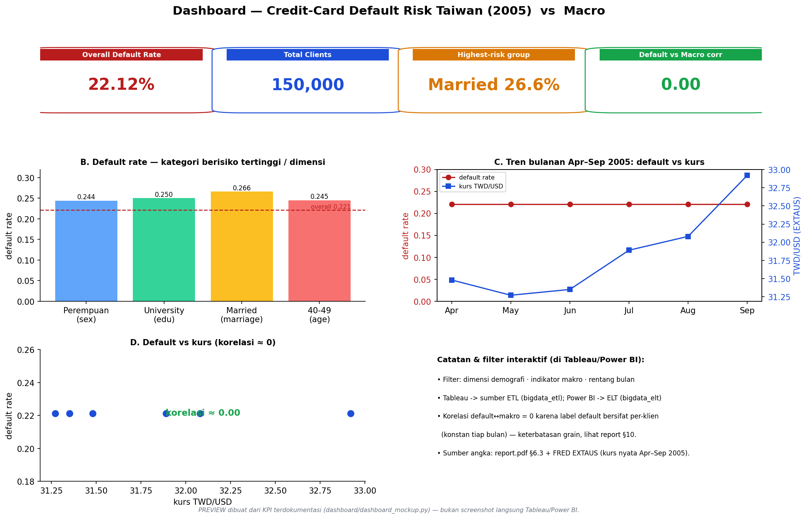

# Preview Dashboard — Visual & Penjelasan
### Tugas Besar Big Data · Credit-Card Default (Taiwan 2005)

> **Preview** dashboard analitik yang dibuat dari **KPI terdokumentasi** (report.pdf §6.3 +
> kurs FRED EXTAUS nyata Apr–Sep 2005). **Bukan** screenshot langsung Tableau/Power BI — file
> `.twbx`/`.pbix` asli dibangun di GUI mengikuti `dashboard/DASHBOARD_BUILD_GUIDE.md`. Gambar
> dihasilkan `dashboard/dashboard_mockup.py`.



---

## Penjelasan per zona (sesuai DASHBOARD_SPEC.md)

### Zona A — Kartu KPI
- **Overall Default Rate = 22,12%** — tingkat gagal bayar keseluruhan (150k klien).
- **Total Clients = 150.000** — jumlah nasabah (hasil augmentasi CTGAN).
- **Highest-risk group = Married 26,6%** — kategori demografi paling berisiko.
- **Default vs Macro corr = 0,00** — korelasi default terhadap indikator makro ≈ nol (lihat Zona D).

### Zona B — Default rate per demografi (distribusi & perbandingan)
Bar tiap **kategori berisiko tertinggi per dimensi**: Perempuan 0,244 (sex), University 0,250
(education), Married 0,266 (marriage), 40–49 0,245 (age). Garis putus-putus merah = **overall 0,221**
sebagai pembanding. Di tool asli, dimensi bisa difilter (sex/education/marriage/age_band).

### Zona C — Tren bulanan Apr–Sep 2005 (dual-axis)
Garis merah = **default rate** (konstan 0,2212), garis biru = **kurs TWD/USD** (EXTAUS, naik
31,48 → 32,92). Memperlihatkan pergerakan makro per bulan terhadap default.

### Zona D — Default vs makro (hubungan)
Scatter kurs (x) vs default rate (y): semua titik **mendatar** → **korelasi ≈ 0,00**. Ini
mengilustrasikan temuan jujur laporan: label `default_payment_next_month` bersifat **per-klien**
(konstan tiap bulan) → variansi bulanan nol → korelasi dengan makro nol (keterbatasan grain, report §10).

### Filter interaktif (di Tableau/Power BI)
Dimensi demografi · indikator makro (FX / real broad EER / reserves) · rentang bulan (Apr–Sep 2005).

---

## Pemetaan ke dua tool
- **Tableau** → warehouse **ETL** (`bigdata_etl.kpi_*`).
- **Power BI** → warehouse **ELT** (`bigdata_elt.kpi_*`).
Desain sama → angka KPI harus cocok (bukti konsistensi ETL vs ELT, report §9).

## Regenerasi
```
python dashboard/dashboard_mockup.py   # -> dashboard/screenshots/dashboard_preview.png (+ .pdf)
```
