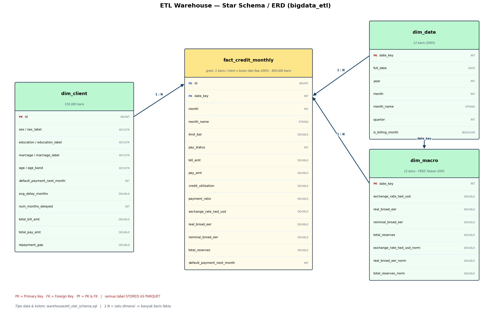

# Dokumentasi Dataset

**Analisis Risiko Gagal Bayar Kartu Kredit Taiwan (2005) dan Kaitannya dengan Lingkungan Makroekonomi**

| | |
|---|---|
| **Mata Kuliah** | Big Data — Tugas Besar |
| **Topik** | No. 7 — Analitik Keuangan dan Transaksi Digital |
| **Sumber Data** | UCI Default of Credit Card Clients (file) + FRED Taiwan (API) |
| **Format** | XLSX/CSV + JSON (multi-format, bonus) |

---

## 1. Ringkasan Dataset

Dokumen ini mendokumentasikan seluruh dataset yang digunakan pada proyek: dua sumber data dengan dua format berbeda, proses augmentasi data sintetis, karakteristik dan kualitas data, fitur hasil rekayasa, serta pemetaan akhir ke skema bintang pada data warehouse Apache Hive. Studi kasus menganalisis risiko gagal bayar (*default*) kartu kredit di Taiwan periode **April–September 2005** dan kaitannya dengan indikator makroekonomi.

| Aspek | Nilai |
|---|---|
| Jumlah sumber data | 2 — UCI (file) + FRED (API) |
| Jumlah format | 2 — XLSX/CSV + JSON (bonus multi-format) |
| Baris data utama (mentah UCI) | ± 30.000 |
| Baris setelah augmentasi CTGAN | 150.000 |
| Baris fakta setelah unpivot bulanan | 900.000 (150.000 klien × 6 bulan) |
| Tipe kolom | numerik + kategorikal + datetime |
| Periode | Tahun 2005 (fakta: Apr–Sep 2005) |
| Tingkat default | 0,2212 (± 22%) |

---

## 2. Sumber Data

| No | Sumber Data | Jenis | Format | Peran |
|----|-------------|-------|--------|-------|
| 1 | UCI Default of Credit Card Clients (id 350) | File | XLSX/CSV | Data utama — perilaku kredit & target default |
| 2 | FRED — Federal Reserve Economic Data (Taiwan) | API | JSON | Data pendukung — indikator makroekonomi |

Penggunaan dua sumber (file + API) sekaligus dua format (XLSX/CSV + JSON) memenuhi persyaratan multisumber dan multiformat (bonus). Kedua sumber dihubungkan melalui dimensi tanggal (`dim_date`): bulan tagihan pada data kredit dipetakan ke bulan kalender 2005 yang sama dengan observasi makro.

---

## 3. Dataset 1 — UCI Default of Credit Card Clients

### 3.1 Deskripsi & Provenance

- **Sumber:** UCI Machine Learning Repository — Default of Credit Card Clients (id 350).
- **URL:** <https://archive.ics.uci.edu/dataset/350/default+of+credit+card+clients>
- **Sitasi asli:** Yeh, I.-C. & Lien, C.-H. (2009), *Expert Systems with Applications*, 36(2), 2473–2480.
- **Cakupan:** data perilaku pembayaran/tagihan nasabah kartu kredit di Taiwan, April–September 2005.
- **Dimensi mentah:** ± 30.000 baris × 25 kolom (1 ID + 23 fitur + 1 target).
- **Akuisisi:** file Excel (`.xls`) diunduh ke `raw/uci_credit_card.xls`; fallback pustaka `ucimlrepo`.

### 3.2 Kamus Data (Data Dictionary)

| Kolom | Tipe | Deskripsi |
|-------|------|-----------|
| `ID` | Integer | Identifier unik nasabah (primary key). |
| `LIMIT_BAL` | Numerik | Batas kredit (NT$) — limit gabungan nasabah & pasangan/keluarga. |
| `SEX` | Kategorikal | Jenis kelamin: 1 = laki-laki, 2 = perempuan. |
| `EDUCATION` | Kategorikal | Pendidikan: 1=graduate school, 2=university, 3=high school, 4=others (0/5/6=unknown). |
| `MARRIAGE` | Kategorikal | Status pernikahan: 1=married, 2=single, 3=others. |
| `AGE` | Numerik | Usia nasabah (tahun). |
| `PAY_0` | Ordinal | Status pembayaran September 2005 (lihat kode status §3.4). |
| `PAY_2 … PAY_6` | Ordinal | Status pembayaran Agustus → April 2005 (tidak ada `PAY_1`). |
| `BILL_AMT1 … BILL_AMT6` | Numerik | Jumlah tagihan (NT$): `BILL_AMT1`=Sep → `BILL_AMT6`=Apr 2005. |
| `PAY_AMT1 … PAY_AMT6` | Numerik | Jumlah pembayaran sebelumnya (NT$): `PAY_AMT1`=Sep → `PAY_AMT6`=Apr 2005. |
| `default payment next month` | Target (biner) | 1 = gagal bayar bulan berikutnya, 0 = tidak. |

> **Catatan penamaan:** pada tahap Standardisasi, seluruh nama kolom diubah menjadi `lowercase snake_case` (mis. `default payment next month` → `default_payment_next_month`).

### 3.3 Encoding Kolom Kategorikal

Nilai kategorikal di-*encode* menjadi label yang terbaca pada tahap transformasi:

| Kolom | Kode → Label |
|-------|--------------|
| `sex` | 1 → `male` · 2 → `female` · lainnya → `unknown` |
| `education` | 1 → `graduate_school` · 2 → `university` · 3 → `high_school` · 4 → `others` · lainnya → `unknown` |
| `marriage` | 1 → `married` · 2 → `single` · 3 → `others` · lainnya → `unknown` |

### 3.4 Kode Status Pembayaran (`PAY_*`)

Kolom `PAY_0` dan `PAY_2..PAY_6` bersifat ordinal dan memakai konvensi:

| Nilai | Arti |
|-------|------|
| `-2` | Tidak ada konsumsi / lunas lebih awal. |
| `-1` | Membayar penuh dan tepat waktu (*paid duly*). |
| `0` | Memakai kredit bergulir (*revolving*), pembayaran minimum. |
| `1 … 9` | Terlambat membayar selama n bulan (1 = telat 1 bulan, dst.). |

### 3.5 Pemetaan Kolom Wide → Bulan

Setiap nasabah membawa 6 bulan riwayat dalam kolom *wide*. Pemetaan ke bulan kalender 2005 (`date_key` = `yyyymm`) yang dipakai saat *unpivot* ke grain bulanan:

| `date_key` | Bulan 2005 | Status | Tagihan | Pembayaran |
|------------|-----------|--------|---------|-----------|
| 200509 | September | `PAY_0` | `BILL_AMT1` | `PAY_AMT1` |
| 200508 | Agustus | `PAY_2` | `BILL_AMT2` | `PAY_AMT2` |
| 200507 | Juli | `PAY_3` | `BILL_AMT3` | `PAY_AMT3` |
| 200506 | Juni | `PAY_4` | `BILL_AMT4` | `PAY_AMT4` |
| 200505 | Mei | `PAY_5` | `BILL_AMT5` | `PAY_AMT5` |
| 200504 | April | `PAY_6` | `BILL_AMT6` | `PAY_AMT6` |

---

## 4. Dataset 2 — FRED Taiwan (Makroekonomi)

### 4.1 Deskripsi & Provenance

- **Sumber:** Federal Reserve Bank of St. Louis — FRED, kategori Taiwan.
- **URL:** <https://fred.stlouisfed.org/categories/32438>
- **Akuisisi:** FRED REST API (output JSON) — satu file `raw/fred_<series>_2005.json` per seri.
- **Periode:** Tahun 2005 (12 observasi bulanan per seri), agar selaras dengan periode tagihan kredit.

> **Catatan:** rencana awal (CLAUDE.md) mencantumkan 10 indikator makro, namun hanya **4 seri** yang benar-benar tersedia bulanan untuk Taiwan 2005 di FRED. Pipeline karena itu menggunakan 4 seri berikut secara nyata.

### 4.2 Seri yang Digunakan

| Series ID | Nama Seri (FRED) | Kolom Warehouse | Satuan | Frekuensi |
|-----------|------------------|-----------------|--------|-----------|
| `EXTAUS` | Taiwan / U.S. Foreign Exchange Rate | `exchange_rate_twd_usd` | TWD per 1 USD | Bulanan, NSA |
| `RBTWBIS` | Real Broad Effective Exchange Rate for Taiwan (BIS) | `real_broad_eer` | Indeks (2020=100) | Bulanan, NSA |
| `NBTWBIS` | Nominal Broad Effective Exchange Rate for Taiwan (BIS) | `nominal_broad_eer` | Indeks (2020=100) | Bulanan, NSA |
| `TRESEGTWM194N` | Total Reserves excluding Gold for Taiwan | `total_reserves` | USD (juta) | Bulanan, NSA |

### 4.3 Struktur JSON

Setiap file mengikuti format respons FRED: metadata (`observation_start`/`end`, `units`, `count`) dan array `observations` berisi objek `{date, value, realtime_start, realtime_end}`. Pipeline membaca pasangan `(date, value)` dan menyusunnya menjadi satu baris per bulan.

```json
{
  "observation_start": "2005-01-01",
  "observation_end": "2005-12-31",
  "units": "lin",
  "count": 12,
  "observations": [
    { "date": "2005-01-01", "value": "31.8465" },
    { "date": "2005-02-01", "value": "31.4976" }
  ]
}
```

### 4.4 Nilai Bulanan 2005

Nilai aktual hasil ekstraksi (dibaca langsung dari file `raw/*.json`):

| Bulan | `EXTAUS` | `RBTWBIS` | `NBTWBIS` | `TRESEGTWM194N` |
|-------|---------:|----------:|----------:|----------------:|
| 2005-01 | 31,8465 | 103,74 | 89,72 | 159.648 |
| 2005-02 | 31,4976 | 105,48 | 91,12 | 160.985 |
| 2005-03 | 31,1055 | 106,55 | 91,97 | 166.224 |
| 2005-04 | 31,4800 | 106,39 | 91,62 | 166.563 |
| 2005-05 | 31,2652 | 107,87 | 92,42 | 171.647 |
| 2005-06 | 31,3473 | 109,61 | 93,41 | 174.113 |
| 2005-07 | 31,8855 | 109,75 | 92,66 | 174.647 |
| 2005-08 | 32,0757 | 108,39 | 91,05 | 174.051 |
| 2005-09 | 32,9248 | 105,43 | 88,92 | 175.062 |
| 2005-10 | 33,4675 | 104,62 | 88,49 | 174.302 |
| 2005-11 | 33,5800 | 103,90 | 89,05 | 176.797 |
| 2005-12 | 33,2861 | 104,00 | 89,42 | 177.217 |

*EXTAUS = nilai tukar TWD/USD; RBTWBIS/NBTWBIS = real/nominal broad effective exchange rate; TRESEGTWM194N = total cadangan devisa (tidak termasuk emas). Bulan tagihan yang dipakai pada fakta adalah April–September.*

---

## 5. Augmentasi Data Sintetis (CTGAN)

Karena jumlah data UCI mentah (± 30.000) kurang dari 100.000 baris, dataset diperbanyak menggunakan **CTGAN** (*Conditional Tabular GAN*) via pustaka SDV (`CTGANSynthesizer`). Augmentasi dilakukan pada data kredit saja, **sebelum** penggabungan dengan data makro.

| Parameter | Nilai |
|-----------|-------|
| Metode | CTGAN (SDV `CTGANSynthesizer`) |
| Baris dihasilkan | 150.000 |
| Baris asli (latih) | 30.000 |
| Epochs | 300 |
| Seed (reproducibility) | 42 |
| Kolom kategorikal dipaksa | `SEX`, `EDUCATION`, `MARRIAGE`, target |
| Kolom di-drop sebelum latih | `ID` |
| Balance kelas target | non-default 0,7788 ; default 0,2212 (dipertahankan) |

**Alasan pemilihan CTGAN:**

- data kredit bersifat *mixed-type* (kontinu + kategorikal + ordinal `PAY_*`) dan *imbalanced*;
- CTGAN menangkap distribusi multimodal lebih baik daripada Gaussian-copula / resampling sederhana;
- *conditional sampler* memberi kontrol eksplisit atas proporsi kelas target;
- menambah volume tanpa mengumpulkan PII baru.

**Potensi bias & keterbatasan:**

- fidelitas data sintetis tidak melebihi sumber aslinya;
- berpotensi *correlation drift* antar kolom;
- bias demografi 2005 ikut diperbesar pada skala 150.000 baris;
- data sintetis menambah volume — bukan informasi baru — sehingga bukan bukti dunia nyata independen.

> Metode lengkap: lihat [`synthetic/CTGAN_METHOD.md`](../synthetic/CTGAN_METHOD.md).

---

## 6. Karakteristik & Kualitas Data

### 6.1 Komposisi Tipe Kolom

| Tipe | Contoh Kolom |
|------|--------------|
| Numerik (kontinu) | `limit_bal`, `bill_amt`, `pay_amt`, `credit_utilization`, `payment_ratio`, indikator makro |
| Kategorikal | `sex`, `education`, `marriage` (+ label hasil encoding), `age_band` |
| Ordinal | `pay_0`, `pay_2..pay_6` (status keterlambatan) |
| Datetime / kalender | `date_key`, `full_date`, `month`, `month_name` (`dim_date`) |
| Target (biner) | `default_payment_next_month` |

### 6.2 Missing Value, Duplikat & Outlier

- **Missing value:** ditangani per tipe data. NaN/Inf terutama muncul setelah operasi rasio (mis. pembagian dengan tagihan nol pada `payment_ratio`) dan dibersihkan; kunci tidak boleh null.
- **Duplikat:** dideduplikasi berbasis primary key `id` (*drop duplicates by PK*).
- **Outlier:** deteksi **IQR** untuk data kredit (robust terhadap distribusi *skewed*) dan **Z-Score** untuk deret makro (mendekati normal); umur di-*clamp* ke rentang [18, 100].
- **Catatan penting:** 78.323 baris dengan `credit_utilization` negatif adalah kondisi **valid** (akun *overpaid*) dan sengaja dipertahankan, bukan dibuang sebagai error.

### 6.3 Kunci (PK/FK) & Integritas

- **Primary key:** `id` pada `dim_client`; `date_key` pada `dim_date` dan `dim_macro`.
- **Foreign key:** `fact_credit_monthly.id` → `dim_client.id`; `fact_credit_monthly.date_key` → `dim_date.date_key`.
- **Validasi:** 6 aturan (uniqueness, null, range, datatype, referential integrity, distribution) — seluruhnya **PASS** pada run nyata.

---

## 7. Standardisasi & Feature Engineering

**Standardisasi:** nama kolom → `lowercase snake_case`; normalisasi *min-max* pada kolom makro terpilih (`exchange_rate_twd_usd`, `real_broad_eer`, `total_reserves`); encoding kategorikal; konsistensi tipe (`double`).

**Lima fitur turunan** dibuat pada tahap *enrichment*:

| Fitur | Definisi | Makna |
|-------|----------|-------|
| `credit_utilization` | `bill_amt / limit_bal` | Rasio pemakaian terhadap limit; tinggi → lebih berisiko. |
| `payment_ratio` | `pay_amt / bill_amt` | Porsi tagihan yang dibayar; rendah → indikasi kesulitan bayar. |
| `avg_delay_months` | rata-rata `PAY_*` | Rata-rata tingkat keterlambatan historis. |
| `num_months_delayed` | jumlah `PAY_*` > 0 | Berapa bulan nasabah terlambat membayar. |
| `repayment_gap` | `total_bill − total_pay` | Selisih total tagihan & pembayaran (beban tersisa). |

---

## 8. Pemetaan ke Skema Data Warehouse (Star Schema)

Setelah transformasi, data dimuat ke Apache Hive (database `bigdata_etl`) dalam skema bintang: satu tabel fakta dengan grain klien × bulan, dan tiga dimensi.

### 8.1 `fact_credit_monthly` (900.000 baris)

| Kolom | Tipe | Keterangan |
|-------|------|-----------|
| `id` | BIGINT | FK → `dim_client` |
| `date_key` | INT | FK → `dim_date` (`yyyymm`) |
| `month` / `month_name` | INT / STRING | Bulan tagihan |
| `limit_bal` | DOUBLE | Batas kredit |
| `pay_status` | INT | Status keterlambatan bulan tsb. |
| `bill_amt` / `pay_amt` | DOUBLE | Tagihan & pembayaran bulan tsb. |
| `credit_utilization` / `payment_ratio` | DOUBLE | Fitur bulanan (engineered) |
| `exchange_rate_twd_usd`, `real_broad_eer`, `nominal_broad_eer`, `total_reserves` | DOUBLE | Enrichment makro via `date_key` |
| `default_payment_next_month` | INT | Target (per klien) |

### 8.2 Dimensi

- **`dim_client`** (150.000 baris): `id` (PK), `sex`/`education`/`marriage` (+ label), `age`, `age_band`, target, dan fitur level klien (`avg_delay_months`, `num_months_delayed`, `total_bill_amt`, `total_pay_amt`, `repayment_gap`).
- **`dim_date`** (kalender 2005): `date_key` (PK), `full_date`, `year`, `month`, `month_name`, `quarter`, `is_billing_month`.
- **`dim_macro`** (12 baris): `date_key` (PK/FK), `exchange_rate_twd_usd`, `real_broad_eer`, `nominal_broad_eer`, `total_reserves`, plus kolom `*_norm` hasil min-max.



*Gambar 8.1 ERD / skema bintang warehouse ETL (`fact_credit_monthly` + dimensi).*

---

## 9. Pemenuhan Spesifikasi Dataset

| Kriteria (brief §4) | Status | Bukti |
|---------------------|:------:|-------|
| ≥ 100.000 baris | ✔ | 150.000 klien sintetis → 900.000 baris fakta |
| ≥ 12 kolom | ✔ | 24 kredit + 4 makro + 5 fitur turunan |
| ≥ 2 sumber | ✔ | UCI (file) + FRED (API) |
| ≥ 2 format (bonus) | ✔ | XLSX/CSV + JSON |
| numerik + kategorikal + datetime | ✔ | lihat §6.1 |
| missing value ada & ditangani | ✔ | ditangani per tipe data (§6.2) |
| duplikat ada & ditangani | ✔ | dedup berbasis PK `id` |
| ≥ 1 kolom ID sebagai PK/FK | ✔ | `id`, `date_key` (§6.3) |
| metode sintetis didokumentasikan | ✔ | CTGAN — §5 + `synthetic/CTGAN_METHOD.md` |

---

## 10. Lisensi & Tautan Akses

- **Dataset utama:** UCI Default of Credit Card Clients (id 350) — <https://archive.ics.uci.edu/dataset/350/default+of+credit+card+clients>
- **Data makro:** FRED Taiwan — <https://fred.stlouisfed.org/categories/32438> (perlu FRED API key untuk *re-extract*).
- **Data sintetis:** `raw/synthetic_credit_clients.csv` (hasil CTGAN, ± 14 MB) disertakan untuk reprodusibilitas.
