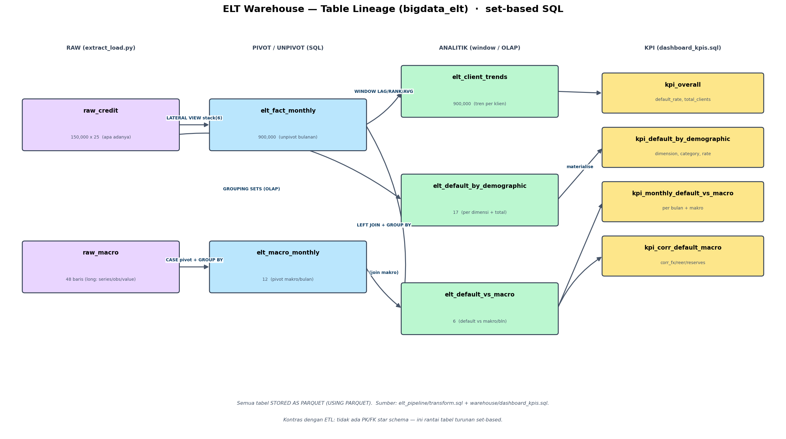

# Dokumentasi ERD / Skema Database
### Tugas Besar Big Data · Credit-Card Default (Taiwan 2005)
*Penjelasan detail skema dua warehouse: ETL (star schema) & ELT (table lineage).*

> Proyek memakai **dua warehouse Hive** dengan pendekatan pemodelan berbeda:
> **`bigdata_etl`** = *star schema* klasik (fakta + dimensi, ber-PK/FK), dibangun pipeline ETL
> (PySpark). **`bigdata_elt`** = rantai *tabel analitik turunan* (set-based SQL), dibangun pipeline
> ELT. Keduanya menyimpan tabel `STORED AS PARQUET` agar terbaca Hive/ODBC.

---

# BAGIAN A — Warehouse ETL: Star Schema (`bigdata_etl`)


**Grain fakta:** satu baris per **klien × bulan tagihan** (Apr–Sep 2005) → **900.000 baris**
(150.000 klien × 6 bulan). Sumber DDL: `warehouse/etl_star_schema.sql`. Diagram dihasilkan
`warehouse/erd_diagram.py`.

## A1. `fact_credit_monthly` (tabel fakta)
Pusat star schema; satu baris per klien per bulan.

| Kolom | Tipe | Peran |
|---|---|---|
| `id` | BIGINT | **FK → dim_client.id** |
| `date_key` | INT | **FK → dim_date.date_key** (yyyymm, mis. 200509) |
| `month`, `month_name` | INT, STRING | atribut bulan |
| `limit_bal` | DOUBLE | plafon kredit |
| `pay_status` | INT | status keterlambatan bulan itu (PAY_*) |
| `bill_amt`, `pay_amt` | DOUBLE | tagihan & pembayaran bulan itu |
| `credit_utilization` | DOUBLE | fitur: `bill_amt / limit_bal` |
| `payment_ratio` | DOUBLE | fitur: `pay_amt / bill_amt` |
| `exchange_rate_twd_usd`, `real_broad_eer`, `nominal_broad_eer`, `total_reserves` | DOUBLE | enrichment makro (di-join via `date_key`) |
| `default_payment_next_month` | INT | label target (0/1) |

## A2. `dim_client` (dimensi klien) — 150.000 baris
| Kolom | Tipe | Peran |
|---|---|---|
| `id` | BIGINT | **PK** |
| `sex` / `sex_label` | INT / STRING | kode + label terbaca |
| `education` / `education_label` | INT / STRING | kode + label |
| `marriage` / `marriage_label` | INT / STRING | kode + label |
| `age` / `age_band` | INT / STRING | umur + kelompok umur |
| `default_payment_next_month` | INT | label (level klien) |
| `avg_delay_months` | DOUBLE | fitur: rata-rata PAY_* |
| `num_months_delayed` | INT | fitur: jumlah bulan delay (>0) |
| `total_bill_amt`, `total_pay_amt` | DOUBLE | total tagihan & bayar |
| `repayment_gap` | DOUBLE | fitur: total_bill − total_pay |

## A3. `dim_date` (dimensi tanggal) — 12 baris (2005)
| Kolom | Tipe | Peran |
|---|---|---|
| `date_key` | INT | **PK** (yyyymm) |
| `full_date` | DATE | tanggal awal bulan |
| `year`, `month`, `month_name`, `quarter` | INT/STRING | atribut kalender |
| `is_billing_month` | BOOLEAN | TRUE untuk Apr–Sep 2005 |

**Peran kunci:** `dim_date` menjadi **jembatan** antara data kredit dan data makro — keduanya
terhubung lewat `date_key`.

## A4. `dim_macro` (dimensi makro) — 12 baris
| Kolom | Tipe | Peran |
|---|---|---|
| `date_key` | INT | **PK & FK → dim_date** |
| `exchange_rate_twd_usd` | DOUBLE | FRED EXTAUS |
| `real_broad_eer` | DOUBLE | FRED RBTWBIS |
| `nominal_broad_eer` | DOUBLE | FRED NBTWBIS |
| `total_reserves` | DOUBLE | FRED TRESEGTWM194N |
| `*_norm` (3 kolom) | DOUBLE | versi min-max ternormalisasi |

## A5. Relasi & kunci (PK/FK)
- `dim_client (id)` **1 : N** `fact_credit_monthly (id)`
- `dim_date (date_key)` **1 : N** `fact_credit_monthly (date_key)`
- `dim_date (date_key)` **1 : 1** `dim_macro (date_key)` → makro nempel ke fakta lewat `date_key`.
- Di Hive, constraint PK/FK bersifat **informasional** (`DISABLE NOVALIDATE RELY`) — didokumentasikan
  di `etl_star_schema.sql`, divalidasi logis oleh aturan *referential integrity* di `transform.py`.

**Kenapa star schema?** mudah dipahami, query agregasi cepat, ramah BI tool (Tableau), dan memisahkan
ukuran (fakta) dari konteks (dimensi).

---

# BAGIAN B — Warehouse ELT: Table Lineage (`bigdata_elt`)



ELT **bukan** star schema, melainkan **rantai tabel turunan** yang dibangun murni SQL set-based
(kontras dengan ETL). Sumber: `elt_pipeline/transform.sql` + `warehouse/dashboard_kpis.sql`.

## B1. Tabel RAW (apa adanya, dari `extract_load.py`)
| Tabel | Bentuk | Kolom utama |
|---|---|---|
| `raw_credit` | 150.000 × 25 | `id, limit_bal, sex, education, marriage, age, pay_0, pay_2..6, bill_amt1..6, pay_amt1..6, default_payment_next_month` |
| `raw_macro` | 48 baris (long) | `series_id, obs_date, value` |

## B2. Tabel turunan (teknik SQL pada tiap langkah)
| Tabel | Baris | Dibuat dari | Teknik SQL |
|---|---|---|---|
| `elt_macro_monthly` | 12 | `raw_macro` | **CASE pivot** + `GROUP BY` (long → wide) |
| `elt_fact_monthly` | 900.000 | `raw_credit` | **`LATERAL VIEW stack(6, …)`** (unpivot 6 bulan di SQL) |
| `elt_client_trends` | 900.000 | `elt_fact_monthly` | **WINDOW**: `LAG`, running `AVG`, `RANK` |
| `elt_default_by_demographic` | 17 | `raw_credit` | **OLAP `GROUPING SETS`** (per dimensi + grand total) |
| `elt_default_vs_macro` | 6 | `elt_fact_monthly` ⨝ `elt_macro_monthly` | `LEFT JOIN` + `GROUP BY` per bulan |

### Kolom kunci tabel turunan
- `elt_macro_monthly`: `date_key, exchange_rate_twd_usd, real_broad_eer, nominal_broad_eer, total_reserves`.
- `elt_fact_monthly`: `id, date_key, limit_bal, pay_status, bill_amt, pay_amt, default_payment_next_month, credit_utilization, payment_ratio`.
- `elt_client_trends`: `id, date_key, bill_amt, pay_amt, credit_utilization, prev_bill_amt, bill_mom_change, run_avg_utilization, bill_rank_in_month`.
- `elt_default_by_demographic`: `sex_label, education_label, marriage_label, age_band, clients, default_rate`.
- `elt_default_vs_macro`: `date_key, default_rate, exchange_rate_twd_usd, real_broad_eer, total_reserves`.

## B3. Tabel KPI (materialisasi, `dashboard_kpis.sql`)
Dibuat **identik** di `bigdata_etl` (sumber Tableau) dan `bigdata_elt` (sumber Power BI):
`kpi_overall`, `kpi_default_by_demographic`, `kpi_monthly_default_vs_macro`, `kpi_corr_default_macro`.

**Kenapa lineage, bukan star?** ELT memperlihatkan kekuatan transform **di dalam** warehouse:
unpivot, window function, dan agregasi OLAP langsung di SQL — tabel-tabel ini *flat/denormalised*
yang dioptimalkan untuk analitik & dashboard, bukan untuk integritas relasional.

---

# BAGIAN C — Kontras Pemodelan ETL vs ELT
| Aspek | ETL (`bigdata_etl`) | ELT (`bigdata_elt`) |
|---|---|---|
| Pemodelan | Star schema (fakta + dimensi) | Rantai tabel turunan (flat) |
| Kunci | PK/FK eksplisit (informasional) | Tanpa PK/FK; relasi lewat `date_key`/`id` di query |
| Lokasi transform | Sebelum load (PySpark) | Di dalam warehouse (SQL) |
| Teknik khas | clean, IQR/Z, unpivot union, fitur ML | CASE pivot, `stack()`, WINDOW, `GROUPING SETS` |
| Cocok untuk | pemodelan & tata kelola | landing cepat + eksplorasi analitik |

---

## Cara regenerasi gambar
```bash
python warehouse/erd_diagram.py        # -> warehouse/erd_star_schema.png (+ .pdf)
python warehouse/elt_lineage_diagram.py# -> warehouse/elt_lineage.png (+ .pdf)
```
File DDL/sumber: `warehouse/etl_star_schema.sql`, `elt_pipeline/transform.sql`,
`warehouse/dashboard_kpis.sql`.
