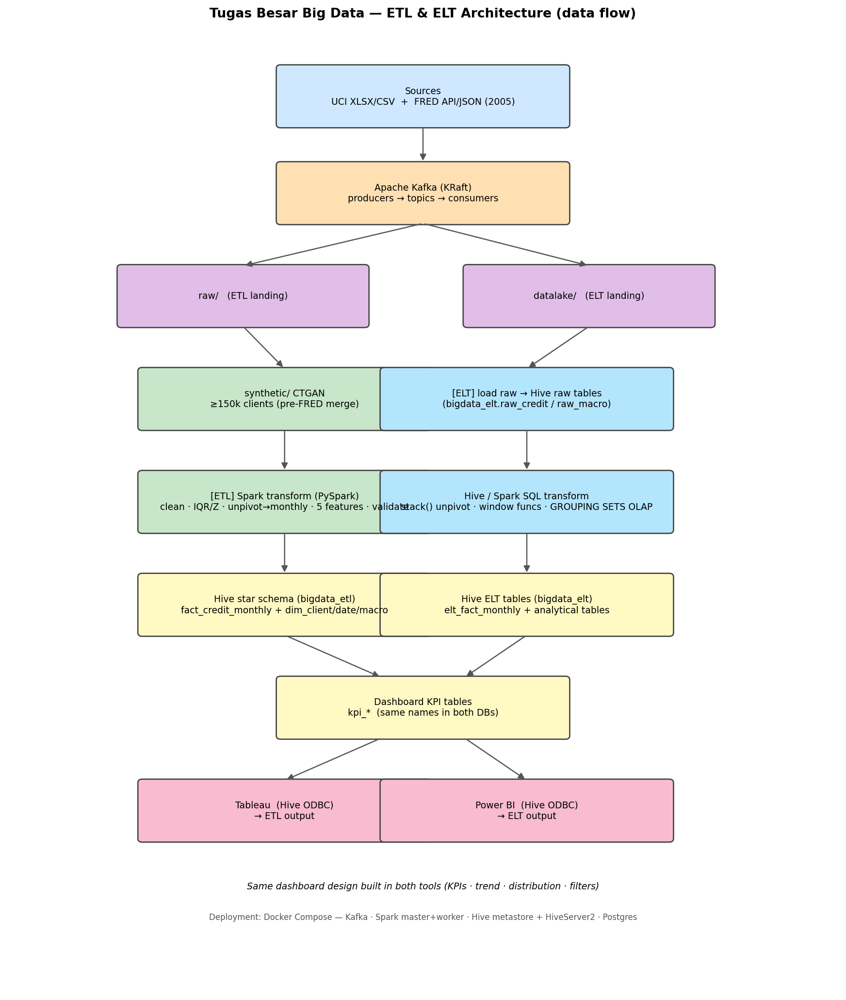

# Tugas Besar Big Data — ETL & ELT Pipeline + Analytics Dashboard
### Credit-Card Default Risk in Taiwan (2005) vs the Macroeconomic Environment

> **Anggota Kelompok (Group of 2):** _[isi nama / NIM anggota 1]_, _[isi nama / NIM anggota 2]_
> · **Topic No. 7** — Analitik Keuangan dan Transaksi Digital · **Semester:** GENAP 2025/2026.

---

## 1. Abstract
Proyek ini membangun **dua pipeline data (ETL dan ELT)** untuk menganalisis **risiko gagal bayar
kartu kredit di Taiwan (2005)** dan kaitannya dengan **lingkungan makroekonomi** (seri FRED Taiwan).
Data primer (UCI *Default of Credit Card Clients*, ~30.000 nasabah) diperbanyak dengan **CTGAN**
menjadi **150.000 nasabah sintetis** (rasio default ~22% dipertahankan), lalu di-*unpivot* menjadi
grain bulanan sehingga menghasilkan **900.000 baris fakta** (Apr–Sep 2005). Pipeline ETL (PySpark,
transform di luar warehouse) dan ELT (SQL window/OLAP di dalam Hive) memuat data ke **data warehouse
Hive** (star schema), lalu divisualisasikan dengan **Tableau (ETL)** dan **Power BI (ELT)** melalui
Hive ODBC. Temuan utama: **tingkat default keseluruhan 0,2212**, dengan perbedaan jelas antar
demografi (jenis kelamin, pendidikan, status pernikahan, kelompok umur), namun **korelasi default
terhadap indikator makro ≈ 0** karena keterbatasan grain label (dijelaskan di §10). Perbandingan
menunjukkan **ELT ~5× lebih cepat** daripada ETL untuk beban kerja ini, sedangkan ETL unggul dalam
*feature engineering* dan kualitas pemodelan.

## 2. Introduction & Problem Statement
- **Latar belakang:** risiko gagal bayar kartu kredit adalah masalah keuangan inti; perilaku
  pembayaran/tagihan nasabah diduga berhubungan dengan kondisi makroekonomi.
- **Pertanyaan analitik:** (1) siapa yang cenderung gagal bayar? (2) pola pembayaran/tagihan apa yang
  memprediksi default? (3) bagaimana risiko default berhubungan dengan **kurs / nilai tukar efektif /
  cadangan devisa** Taiwan sepanjang Apr–Sep 2005?
- **Tujuan & ruang lingkup:** membangun ETL + ELT yang dapat direproduksi, sebuah data warehouse
  analitik, dan dashboard interaktif; serta membandingkan kedua pendekatan pipeline secara empiris.

## 3. Datasets (brief §4)
- **Sumber 1 (Primer):** UCI *Default of Credit Card Clients* (id 350), format **XLSX/CSV**, ~30.000
  baris × 24 kolom (23 fitur + 1 target `default payment next month`); riwayat tagihan Apr–Sep 2005.
  Link: <https://archive.ics.uci.edu/dataset/350/default+of+credit+card+clients>
- **Sumber 2 (Sekunder):** **FRED** Taiwan macro via **FRED API (JSON)** — seri `EXTAUS`, `RBTWBIS`,
  `NBTWBIS`, `TRESEGTWM194N` (bulanan, 2005). Link kategori:
  <https://fred.stlouisfed.org/categories/32438>
- **Temuan jujur:** FRED **tidak** menyediakan suku bunga/CPI/pengangguran **bulanan** untuk Taiwan
  2005 → cakupan makro dibatasi pada **kurs + cadangan devisa**. Indikator lain hanya
  tahunan/kuartalan (konstan di grain bulanan → tidak berguna).
- **Multi-source ✅** (UCI + FRED) · **multi-format ✅** (XLSX/CSV + JSON, bonus).

## 4. Architecture (CLAUDE.md §5)

- **Tech stack:** Apache **Kafka** (KRaft) untuk extract bus; Apache **Spark** (master+worker,
  `local[*]`) untuk transform ETL; Apache **Hive** (metastore + HiveServer2, backing **Postgres**)
  sebagai warehouse; **Tableau + Power BI** via **Hive ODBC**; seluruhnya di **Docker Compose**.
- **Alasan pemilihan:** Kafka memisahkan extract dari pemrosesan (dapat di-stream/idempoten); Spark
  menangani transform baris-per-baris berskala besar; Hive menyediakan warehouse SQL yang dapat
  diakses ODBC oleh kedua BI tool; Docker Compose membuat seluruh stack reprodusibel sekali jalan.

## 5. Synthetic Augmentation — CTGAN (method / rationale / bias)
- **Metode:** SDV `CTGANSynthesizer`. Dilatih dari tabel UCI asli (~30.000 baris); `SEX`,
  `EDUCATION`, `MARRIAGE`, dan target dipaksa **kategorikal**; `ID` di-*drop* sebelum training.
  **Conditional sampling** menjaga rasio kelas. **Parameter ter-realisasi**
  (`synthetic/ctgan_summary.json`): **rows = 150.000**, **epochs = 300**, **seed = 42**,
  balance = *preserve_original* → **{non-default 0,7788 ; default 0,2212}**, real_rows = 30.000.
- **Rationale:** fitur kredit *mixed-type* (kontinu + kategorikal + ordinal `PAY_*`); CTGAN menangani
  data tabular multimodal/imbalanced lebih baik daripada Gaussian-copula/resampling, dan *conditional
  sampler* memberi kontrol eksplisit atas kelas default. Menambah volume tanpa mengumpulkan PII baru.
- **Bias & keterbatasan** (ringkas dari `synthetic/CTGAN_METHOD.md` §3): fidelitas ≤ sumber; potensi
  *correlation drift* antar kolom; bias demografi 2005 ikut diperbesar di skala 150k; data sintetis
  menambah volume **bukan informasi** → tidak boleh dianggap bukti dunia nyata independen.

## 6. Part I — ETL Pipeline (weight 30%)
### 6.1 Extract — `etl_pipeline/extract.py`
- Dua sumber diunduh **apa adanya** ke `raw/` (tanpa cleaning); tiap sumber mencatat log
  (rows, cols, size, duration) ke `etl_pipeline/logs/`. Varian streaming: `kafka_producer.py` /
  `kafka_consumer.py` (sumber → topik Kafka → `raw/` + `datalake/`).
- Hasil: `raw/uci_credit_card.xls` (30.000×25) + `raw/fred_<id>_2005.json` ×4 (12 observasi/seri).

### 6.2 Transform — `etl_pipeline/transform.py` (PySpark)
- **(a) Cleaning:** dedup PK `id`; missing per-dtype; standardisasi tanggal; outlier **IQR** (kredit)
  + **Z-score** (makro); clamp `age`∈[18,100].
- **(b) Standardisasi:** kolom → `snake_case`; **min-max normalise** `exchange_rate_twd_usd`,
  `real_broad_eer`, `total_reserves`; encode kategori (label terbaca); enforce dtype.
- **(c) Enrichment:** **unpivot wide→bulanan** (Apr–Sep 2005); join makro via `date_key`; **5 fitur**:
  `credit_utilization`, `payment_ratio`, `avg_delay_months`, `num_months_delayed`, `repayment_gap`.
- **(d) Validation — 6/6 PASS** (`warehouse/staging/validation_report.json`):

| Rule | Hasil |
|---|---|
| uniqueness (id, date_key) | 0 pelanggaran ✅ |
| not-null keys | 0 pelanggaran ✅ |
| range checks | 0 pelanggaran ✅ (78.323 utilisasi negatif **valid** — akun overpaid, sengaja dipertahankan) |
| dtype consistency | konsisten (double) ✅ |
| referential integrity | 0 orphan date / 0 orphan client ✅ |
| distribution default_rate | 0,2212 ✅ |

- **Output staging:** `fact_credit_monthly` **900.000** baris, `dim_client` 150.000, `dim_date` 12,
  `dim_macro` 12.

### 6.3 Load — `etl_pipeline/load.py` + Star Schema

- Star schema `bigdata_etl`: `fact_credit_monthly` (FK→`dim_client`, `dim_date`) + `dim_client`,
  `dim_date`, `dim_macro`. PK/FK didokumentasikan (`DISABLE NOVALIDATE RELY`, informasional).
- **8 query analitik** (`warehouse/etl_analytical_queries.sql`):

| # | Query | Hasil ringkas |
|---|---|---|
| Q1 | overall default | **0,2212** |
| Q2 | per jenis kelamin | perempuan **0,2439** > laki-laki **0,1991** |
| Q3 | per pendidikan | university **0,2504** tertinggi; others **0,0752** terendah |
| Q4 | per status nikah | married **0,2661** tertinggi |
| Q5 | per kelompok umur | 40–49 **0,2451** tertinggi; 60+ **0,1568** terendah |
| Q6 | tren bulanan | `credit_utilization` naik **0,306 → 0,478** (Apr→Sep) |
| Q7 | default vs makro/bulan | kurs **31,48 → 32,92**; default rate konstan 0,2212 |
| Q8 | korelasi default↔makro | **≈ 0,0** (lihat §10) |

## 7. Part II — ELT Pipeline (weight 30%)
- **Extract + Load:** `elt_pipeline/extract_load.py` memuat sumber **apa adanya** ke Hive
  `bigdata_elt.raw_credit` (150.000×25) & `raw_macro` (48 baris = 4 seri × 12 bulan). Tanpa
  unpivot/fitur. Metadata: `elt_pipeline/logs/load_metadata.json`.
- **Transform in-warehouse** (`elt_pipeline/transform.sql`, dijalankan `run_transform.py`) — murni SQL
  set-based, **kontras** dengan ETL Python:
  - **`LATERAL VIEW stack(6, …)`** → unpivot ke `elt_fact_monthly` (**900.000** baris).
  - **Window functions** (`LAG`, running `AVG`, `RANK`) → `elt_client_trends` (900.000).
  - **OLAP `GROUPING SETS`** → `elt_default_by_demographic` (17 baris: per dimensi + grand total).
  - Pivot makro (`CASE…MAX`) → `elt_macro_monthly` (12); join → `elt_default_vs_macro` (6).

## 8. Part III — Dashboards (weight 25%)
- Desain **sama** di **Tableau (→ `bigdata_etl`)** & **Power BI (→ `bigdata_elt`)** atas tabel `kpi_*`
  via Hive ODBC. Spesifikasi: `dashboard/DASHBOARD_SPEC.md`; langkah membangun:
  `dashboard/DASHBOARD_BUILD_GUIDE.md`.
- **KPI:** overall default rate; default per demografi (sex/education/marriage/age_band); korelasi
  default↔makro.
- **4 zona:** (A) kartu KPI, (B) bar per-demografi, (C) tren dual-axis Apr–Sep 2005, (D) scatter
  default-vs-makro. **Filter interaktif:** dimensi demografi, indikator makro, rentang bulan.
- Screenshot di `dashboard/screenshots/` (lihat daftar nama file di `screenshots/README.md`).

## 9. ETL vs ELT — Comparative Analysis (weight 15%)
**Angka terukur** (`analysis/etl_vs_elt_metrics.md`, instrumentasi `common/metrics.py`):

| Pipeline | Total runtime | Peak RSS | Code LOC |
|---|--:|--:|--:|
| **ETL** | **123,94 s** | 95,5 MB | 500 |
| **ELT** | **24,59 s** | 56,9 MB | 274 |

- ETL transform (PySpark, 900.000 baris) = **109,05 s**; CTGAN (sekali, pra-step) = 1.793 s/150k.
- **Interpretasi:** ELT **~5× lebih cepat** karena transform set-based dijalankan mesin SQL Hive
  langsung pada data yang sudah dimuat; ETL lebih berat di hulu (compute Python/Spark sebelum load)
  tetapi menghasilkan *star schema* bersih + fitur ML dan validasi. **ETL** cocok saat butuh fitur
  rekayasa & tata kelola; **ELT** cocok untuk *landing* cepat + eksplorasi in-warehouse yang murah
  diiterasi. Diskusi lengkap: `analysis/ETL_vs_ELT_comparison.md`. Bonus: bandingkan screenshot
  Tableau vs Power BI sebagai bukti visual (angka KPI harus cocok).

## 10. Key Findings
- **Tingkat default keseluruhan 0,2212** (≈22%).
- **Pendorong demografis terkuat:** married (0,2661), university (0,2504), perempuan (0,2439),
  umur 40–49 (0,2451) memiliki risiko tertinggi pada masing-masing dimensi.
- **`credit_utilization` naik** sepanjang Apr→Sep 2005 (0,306→0,478) — tekanan tagihan meningkat.
- **Korelasi default↔makro ≈ 0:** label `default_payment_next_month` bersifat **per-klien** dan
  didenormalisasi ke 6 baris bulanan → variansi default antar bulan **nol** → korelasi dengan makro
  (yang bervariasi per bulan) = 0. Ini **keterbatasan grain**, bukan temuan ekonomi; analisis makro
  yang bermakna butuh label default yang *time-varying*.
- **Caveat data sintetis:** hasil tidak mewakili populasi nyata mana pun (lihat §5).

## 11. Dataset Spec Compliance Checklist (brief §4)
- [x] ≥100.000 baris — **900.000** baris fakta (150k × 6 bulan)
- [x] ≥12 kolom — 24 kredit + 5 fitur rekayasa + 4 kolom makro
- [x] ≥2 sumber — UCI + FRED API
- [x] ≥2 format — XLSX/CSV + JSON (bonus)
- [x] numerik + kategorikal + datetime
- [x] missing values ada & ditangani
- [x] duplikat ada & ditangani (dedup PK)
- [x] ≥1 kolom ID sebagai PK/FK (`id`, `date_key`)
- [x] metode sintetis terdokumentasi (§5 + `synthetic/CTGAN_METHOD.md`)

## 12. Design Decisions & Rationale (brief §11)
| Keputusan | Pilihan | Alasan |
|---|---|---|
| Warehouse | Hive | SQL warehouse open-source, dapat diakses ODBC oleh Tableau & Power BI |
| Fact grain | client × bulan (unpivot) | linkage makro lebih kaya, memenuhi ≥100k baris |
| Outliers | IQR (kredit) / Z-score (makro) | IQR robust untuk distribusi miring; Z-score untuk deret kontinu |
| Set makro | FX + reserves (tanpa suku bunga) | keterbatasan cakupan bulanan FRED untuk Taiwan |
| Sintetis | CTGAN, conditional balance | tabular mixed-type + kontrol kelas target |
| Pembagian ETL/ELT | fitur Python vs window/OLAP SQL | kontras metodologis yang genuine |
| Penyimpanan tabel | PARQUET | terbaca Hive/ODBC, kolumnar efisien |

## 13. Reproducibility & Run Order
- Prasyarat: Docker Desktop, `.env` (FRED key). `docker compose build && docker compose up -d`.
- Urutan: extract → (sekali) CTGAN → ETL transform → ETL load → ELT extract_load → ELT transform →
  dashboard KPIs → comparison → diagram. Perintah lengkap di `README.md` & `docs/CARA_MENJALANKAN.pdf`.
- `requirements.txt` ter-pin; CTGAN ber-seed (42). **Hardware yang dipakai:** _[isi spesifikasi mesin]_.

## 14. Conclusion & Limitations
Proyek berhasil membangun ETL + ELT yang reprodusibel, warehouse Hive berskema bintang, dan dashboard
ganda. Keterbatasan utama: (1) data sintetis tidak mewakili populasi nyata; (2) cakupan makro FRED
Taiwan terbatas pada FX + cadangan; (3) korelasi default↔makro nol akibat grain label. Pengembangan
lanjut: label default time-varying, sumber makro non-FRED (DGBAS/CBC), dan evaluasi fidelitas CTGAN
(`evaluate_quality`).

## 15. References
- UCI ML Repository id 350 — Default of Credit Card Clients.
- FRED (Federal Reserve Economic Data) — seri Taiwan `EXTAUS`, `RBTWBIS`, `NBTWBIS`, `TRESEGTWM194N`.
- SDV / CTGAN (Xu et al., 2019, *Modeling Tabular Data using Conditional GAN*).
- Apache Kafka, Apache Spark, Apache Hive — dokumentasi resmi.

---
> **Cara membuat `report.pdf`:** jalankan `python report/build_report_pdf.py` (render via xhtml2pdf,
> menaruh `report.pdf` di root). Gambar `architecture_diagram.png` & `warehouse/erd_star_schema.png`
> ikut tertanam.
